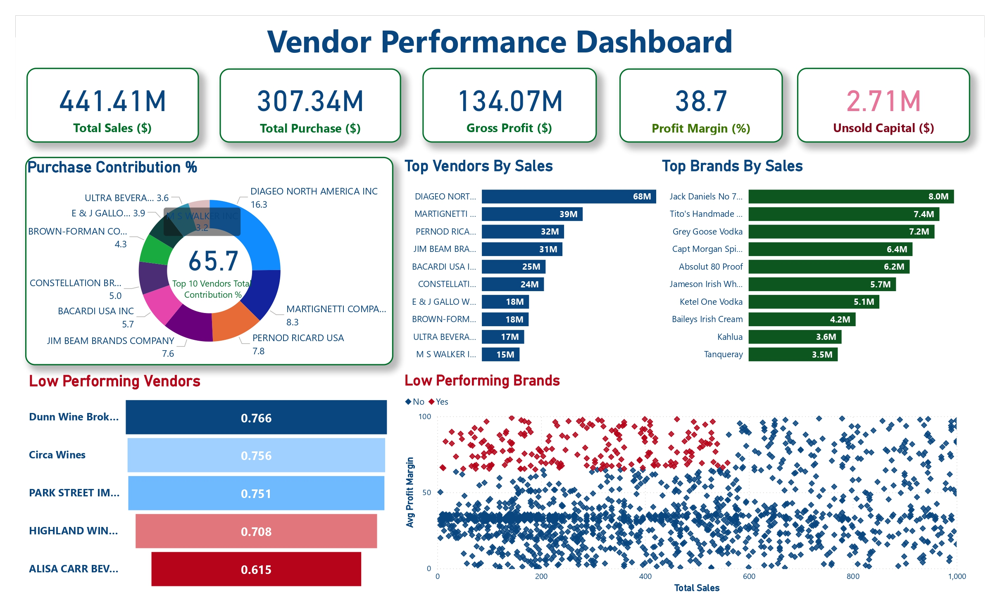

# Vendor Performance Analysis & Dashboard

##  Overview
This project analyzes **vendor and brand performance** using sales, purchase, pricing, and inventory data.  
The goal is to identify **top-performing vendors**, **low-performing vendors/brands**, and uncover **profitability and inventory insights** through an end-to-end data analytics workflow.

---

##  Tools & Technologies
- Python (Pandas, SQLAlchemy)
- SQL (CTEs, joins, aggregations)
- SQLite / MySQL
- Power BI
- Git & GitHub

---

##  Data Pipeline
- CSV files ingested into database using Pandas
- Multiple tables merged using SQL
- Data cleaned and enriched with business metrics:
  - Gross Profit
  - Profit Margin
  - Stock Turnover
  - Sales-to-Purchase Ratio
- Final dataset visualized in Power BI

---

##  Dashboard Screenshot

**Key Insights:**
- A small group of vendors contributes a large share of sales and purchases
- Profit margins vary significantly across brands
- Some vendors show low stock turnover, indicating inventory inefficiencies
- Unsold capital highlights opportunities for better inventory planning

---

##  Metrics Analyzed
- Total Sales & Purchases
- Gross Profit & Profit Margin
- Unsold Capital
- Vendor Purchase Contribution
- Top Vendors & Brands by Sales
- Low Performing Vendors & Brands

---

##  How to Run

python Scripts/ingestion_db.py
python Scripts/get_vendor_summary.py

---

##  Author

**Umesh Pratap Singh**  
Aspiring Data Analyst | SQL | Power BI | Python
